# Canadian Slang Quiz


[Canadian Slang Quiz](https://canadian-slang-quiz.herokuapp.com/) is Python terminal quiz game, which runs in the Code Institute mock terminal on [Heroku](https://heroku.com/).  
Users can test their knowledge of Canadian slang through this quiz. For each term, there are three possible answers from which the user chooses one. For the correct answer, an example of the use of the term is also provided.  
  
[Here you have a live version of the project.](https://canadian-slang-quiz.herokuapp.com/)  

---

## Table of Contents

1. <details>
   <summary><a href="#ux">UX</a></summary>

   - [Visitor Goals](#visitor-goals)
   - [Business Goals](#business-goals)
   - [User Stories](#user-stories)

</details>

2. <a href="#how-to-play">How to Play</a>

</details>

3. <details>
   <summary><a href="#features">Features</a></summary>

   - [Future Features](#future-features)

</details>

4.  <details>
    <summary><a href="#validation-and-testing">Validation and Testing</a></summary>
    <ul>
    <li><a href="#validation">Validation</a></li>
    <li><a href="#testing">Testing</a></li>

    <li>
    <details>
    <summary><a href="#bugs">Bugs</a></summary>

    - [Fixed Bugs](#fixed-bugs)
    </details>
    </li>
    </ul>

</details>
  
5. <details>
    <summary> <a href="#deployment">Deployment</a></summary>

      - [Local Deployment](#local-deployment)
      - [Heroku Deployment](#heroku-deployment)

</details>

6. <a href="#credits">Credits</a>

7. <a href="#tools-and-platforms">Tools and Platforms</a>

8. <a href="#content">Content</a>

9. <a href="#media">Media</a>

---

## UX

### Visitor Goals  
The target audience for [Canadian Slang Quiz](https://canadian-slang-quiz.herokuapp.com/) are:  
- People who are interested in languages (in this case English spoken in Canada).  
- People who already know Canadian slang, but want to confirm their knowledge  
- People who want to learn some Canadian slang.
- People who immigrated to Canada and want to integrate by learning local slang.  
- People who want to have fun and learn something new.  

User goals are:  
- To learn new words through a quiz, and by scoring to motivate to score as many points as possible.  
- To have fun while learning by competing against opponents.  
- To get to know Canada itself through new learned words, for which they will get an explanation.  
- To challenge yourself and question your existing knowledge.  

### Business Goals  
The Business Goals of [Canadian Slang Quiz](https://canadian-slang-quiz.herokuapp.com/) are:  
- To provide a simple educational quiz.  
- Where through the use of the application, users gain knowledge of Canadian slang.  
- By scoring the results, users are encouraged to repeat the quiz in order to be more successful and thus learn faster.  
- Get users interested in Canadian culture.  

### User Stories  
- As a user interested in the quiz, I expect the game instructions to be clear and not complicated.  
- That my score is displayed in the table, and that I can compete with my friends who will get more points.  
- As a user who is interested in language quizzes, I want to get an explanation for the given term (question).  

---

## How to Play  
  
[Canadian Slang Quiz](https://canadian-slang-quiz.herokuapp.com/) is a classic quiz game, with a set question, in this case the question is a language term and three possible answers, one of which is correct.  
- Upon launching the application, a welcome message and game rules are displayed.  
- For each question there are three offered answers, to which the user answers by entering one of three options: A, B or C.  
- The user is given the option to continue with the game and type in name or to quit.  
- After ten questions, the user receives as a result the percentage of correctly answered questions entered in the results table.  
- The user also receives a congratulatory message and a question whether he wants to repeat the game or to quit.  

---

## Features  
- The first thing I wanted users to encounter were:
  - The welcome message with something typical of Canada, in this case a [Maple Leaf ASCII Art](https://emojicombos.com/maple-leaf-ascii-art)  
  - The rules of the game, to familiarize them with what awaits them 
  - And to give them the opportunity to decide whether they want to continue or quit. In order to keep repeating the question until an affirmative or negative answer is obtained, in order to achieve this I decided to use a "while loop" and a "break statement", and to quit the game I used the built-in Python quit() Function (After researching, solution discovered on [exit() in Python](https://www.scaler.com/topics/exit-in-python/)).
  - To control the flow of response input, I opted for "if / else Statements" where I decided to convert the user's response to lowercase using the string [lower() Method](https://www.w3schools.com/python/ref_string_lower.asp) for comparison
  
- Then I wanted the user to be greeted after entering the name and after completing the quiz, his personal score would be entered in the table.  
- For the name query, I opted for the [Built-in Function input()](https://docs.python.org/3/library/functions.html#input) as a simple and effective solution, and I decided not to limit the input of the name to letters only, because there might be multiple users of the same name. So, users can use other characters to distinguish themselves.  
- Since I wanted to use the username and result for messages through other functions, I added the [Keyword global](https://www.w3schools.com/python/python_variables_global.asp) even though it may lead to potential problems when extending the application. But given the current scope of the game, I found it acceptable (although I plan on removing them in future versions). While the other variables to which I first assigned global(example: `global meaning`), I removed and added as an argument to the functions that use them(`check_answer(user_answer, correct_answer, meaning)`).
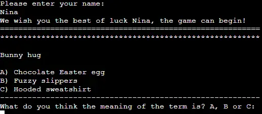  
- As for the quiz itself, I decided that in the first version there would be ten questions that would not appear randomly (you can see here [future planned upgrades](#future-features)), so that the user would get used to the terms faster and learn them as soon as possible. In order to indicate the border between the question,answers, messages in order to make it more readable, I added the lines of stars, dashes. Because this quiz is designed as an educational application. As for the answer, three possibilities are allowed A, B or C, all other entries will cause an invalid entry message ([For more look at Testing section](#testing))
- For iterating through the lists of questions and answers, I decided on a "for loop", where I found inspiration in the following project [Python quiz game](https://www.youtube.com/watch?v=yriw5Zh406s)
- I decided to chain functions for better control of the flow, after talking with the mentor  
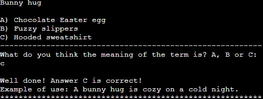  
- As I mentioned, this application is intended as an educational one, that's why I decided that for a correctly answered question, the user will receive an example of the use of the term. But in order to motivate users to repeat the game (through repetition one learns), there is no explanation for incorrect answers.
- To check the accuracy of the results, I defined a simple function with an "if else statement" where the correct and the entered answer are compared, considering it the simplest and most effective solution.
- While to check the validity of the answer entry, I used a combination of if statements with try /except inspired by the [Love Sandwiches Project by Code Institute](https://codeinstitute.net) and [Errors and Exceptions](https://docs.python.org/3/tutorial/errors.html)  
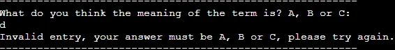  
- I thought it would be best to display the user's results in tabular form and for the code I used the article [How to Create Tables in Python (With Examples)](https://www.statology.org/create-table-in-python/) and [tabulate library](https://pypi.org/project/tabulate/) which is installed by entering the following command in the terminal `pip install tabulate`.
- Since I wanted the results to be displayed in descending order, I researched and found the following solution [itemgetter from operator module](https://docs.python.org/3/library/operator.html#operator.itemgetter) to retrieve specific fields from a list with `sorted()` method ([Python sorted()](https://www.programiz.com/python-programming/methods/built-in/sorted)) and to achieve the desired results I added `reverse=True` so that ranking list is in descending order.  
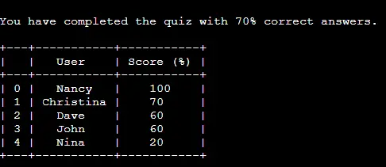  
- As a final feature, along with the final message to the user I wanted to add the possibility to restart the quiz.
- Where I decided to use all the concepts used in the previous code  
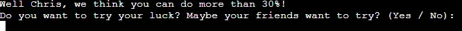  

### Future Features  
- Colored text with [colorama module](https://pypi.org/project/colorama/)  
- A random selection of questions  
- Increased number of questions and transferred to a separate file  
- Ability to choose the number of questions  
- Adding strip() method to remove the space and accept input of answers and Yes/No.

---

## Validation and Testing

### Validation  
Python code passed through [Code Institute CI Python Linter](https://pep8ci.herokuapp.com/) shows no errors.
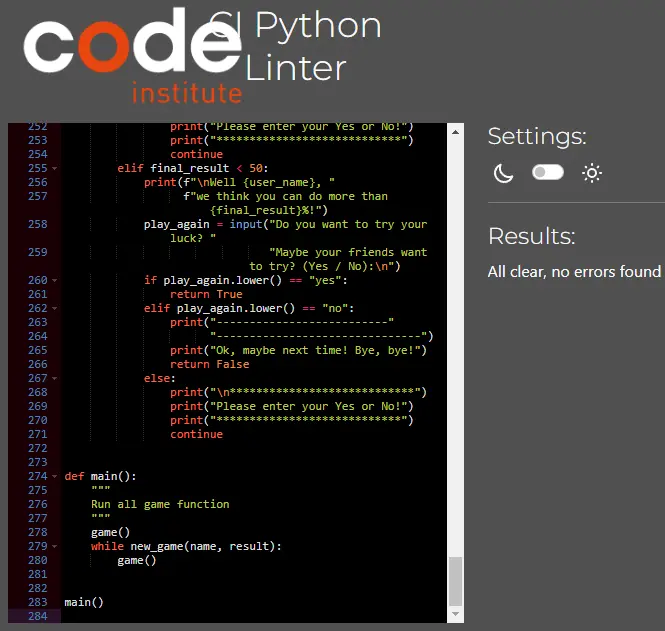  

### Testing  
After validation through [Code Institute CI Python Linter](https://pep8ci.herokuapp.com/), the rest of the testing was done manually in console and on deployed project.  
While coding I mostly used the print function to check if I was getting the intended results.  

<table>
   <thead>
     <tr>
       <th>Expected </th>
       <th>Testing</th>
       <th>Result</th>
       <th>Fix</th>
       <th>Possible upgrade</th>
   </thead>
   <tbody>
     <tr>
       <td>The opening prompt in the game is:  "Do you want to test your knowledge? (Yes / No)" with the expected answer is either "Yes" or "No" (lowercase or uppercase letters are allowed). Any other entry will cause a message "Incorrect entry! Your answer must be Yes or No!" The message will be repeated until the conditions are met. If "Yes" is selected it continues its flow, if "No" is selected it quits the program.</td>
       <td>I tested the feature by entering various upper and lower case letters, words, numbers, symbols, blank lines, spaces, combinations of all of the above.</td>
       <td>The program feature behaved as I planned, only "Yes" or "No" input was accepted in all forms except with added space.</td>
       <td>No fix needed.</td>
       <td>Adding strip() method to remove the space and accept input.</td>
     </tr>
     <tr>
       <td>"Please enter your name:" feature of the program expects the user's name to be entered and all characters, including spaces, are accepted. So that users of the same name could add some symbol for differentiation.</td>
       <td>I did the testing by entering all possible characters, spaces.</td>
       <td>Everything was accepted. But for the sake of readability, the number of characters should be limited to about 20 in the future version.</td>
       <td>No fix needed.</td>
       <td>Character limit.</td>
     </tr>
     <tr>
       <td>The next feature tested is entering answers to questions. Where it is expected to accept A, B or C for input (lowercase or uppercase). An error is expected for every other input: "Invalid entry, your answer must be A, B or C, please try again.". The message will be repeated until the conditions are met.</td>
       <td>I tested the feature by entering various upper and lower case letters, words, numbers, symbols, blank lines, spaces, combinations of all of the above.</td>
       <td>The application behaved as I expected, the entries A, B, C were accepted (uppercase and lowercase except with added space). For all others, an invalid input message was output</td>
       <td>No fix needed.</td>
       <td>Adding strip() method to remove the space and accept input.</td>
     </tr>
     <tr>
       <td>The last question to the user is whether he wants to repeat the game and the possible answers are "Yes" and "No". If "Yes" is selected it continues its flow, if "No" is selected it quits the program. "Please enter your Yes or No!" message is received for all other entries. The message will be repeated until the conditions are met.</td>
       <td>I did the testing by entering all possible characters, spaces etc.</td>
       <td>The program feature behaved as I planned, only "Yes" or "No" input was accepted in all forms except with added space.</td>
       <td>No fix needed.</td>
       <td>Adding strip() method to remove the space and accept input.</td>
     </tr>
   </tbody>
 </table>

Testing examples:  
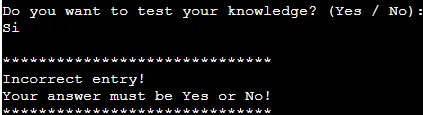  
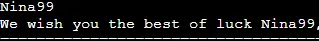  
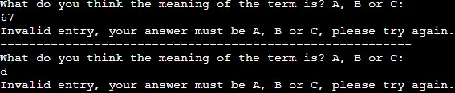  


### Bugs  

#### Fixed Bugs  
- Some lines of code were too long, so I was getting an E501 error. Using the recommendations from the article [How to Break Long Lines in Python](https://www.codingem.com/python-how-to-break-long-lines/), I break long lines of code, so the error no longer appears.  
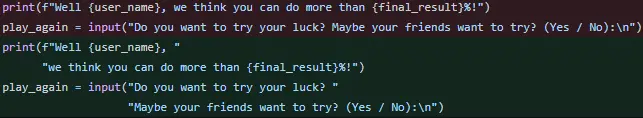

- After fixing the problem with lines that were too long, the result variable was no longer displayed. The solution was simple, when I brake the line, I forgot to add the prefix f (f-Strings)  
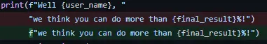

---

## Deployment
### Local Deployment
#### Requirements
- An IDE of your choice ([Visual Studio Code](https://code.visualstudio.com/))
- [Git](https://git-scm.com/)
- [Python](https://www.python.org/)

#### How to Clone

1. Go to the repository of [project](https://github.com/radule90/CI_PP_3)
2. Click on the Code button above the list of files
3. Choose one of remote URL: HTTPS, SSH, GitHub CLI and click the copy button or download a copy of the [project repository](https://github.com/radule90/CI_PP_3/archive/refs/heads/main.zip) and extract the zip file to your base folder.
4. In your IDE Terminal change the current working directory to the one where you want the clone
5. Type following code (for example is used GitHub CLI URL) in Git Bash/Terminal of IDE and press Enter:

   ```
   git clone https://github.com/radule90/CI_PP_3.git
   ```

6. In order to work properly, it needs to be installed [tabulate library](https://www.statology.org/create-table-in-python/), type following code in Git Bash/Terminal:

   ```
   pip install tabulate
   ```

7. You can run the project after you have Python installed, run it on an HTTP server with Python with a command such as:

   ```
   python3 run.py
   ```

#### How to Fork

1. Go to the repository of [project](https://github.com/radule90/CI_PP_3)
2. Bellow navigation bar on the top of the page in right corner you will locate Fork button
3. When clicked, you should have a copy of repository in your GitHub

### Heroku Deployment
- A requirements.txt file created with pip freeze > requirements.txt.
- Create a new [Heroku](https://heroku.com/) app, select name and region  
- In Settings, set the buildpacks to Python and NodeJS in that order  
- In Deploy section,  select the Github repository from the menu
- Link the Heroku app to the Github repository  
- Deploy the repository  
- Click the View App button to see live version of the project

---

## Credits

- [Code Institute](https://codeinstitute.net/de/)
- Rory Patrick Sheridan (Mentor) - Great advice and guidance
- [W3Schools](https://www.w3schools.com) - Additional learning resources
- [Bro Code](https://www.youtube.com/watch?v=yriw5Zh406s) - Python quiz game / Used as a reference to build the app  

---

## Tools and Platforms

- [Gitpod](https://gitpod.io/) - IDE for project development
- [Github](https://github.com/) - Storing code remotely
- [Heroku](https://heroku.com/) - Deployment
- [CI Python Linter](https://pep8ci.herokuapp.com/)
- [Python](https://www.python.org/)
- [Am I Responsive](https://ui.dev/amiresponsive) - For device mockup images
- [FireShot: Full Webpage Screenshots + Annotations](https://getfireshot.com/) - Screen Capture
- [cloudconvert](https://cloudconvert.com/png-to-webp) - Online png to webp converter

---

## Content

- The following tutorials and articles helped me arrive at the final code solution
  - [Python quiz game](https://www.youtube.com/watch?v=yriw5Zh406s)  
  - [Build a Quiz Application With Python](https://realpython.com/python-quiz-application/)  
  - [Python for Beginners – Full Course [Programming Tutorial]](https://www.youtube.com/watch?v=eWRfhZUzrAc)  
  - [Python Full Course for free](https://www.youtube.com/watch?v=XKHEtdqhLK8)  

---

## Media

- [Word Power: Test Your Knowledge of These Canadian Slang Terms](https://www.readersdigest.ca/culture/canadian-slang-terms/) - The questions in the quiz are taken from this article  
- [Maple Leaf ASCII Art](https://emojicombos.com/maple-leaf-ascii-art) - The maple leaf used in the quiz was taken from this site  