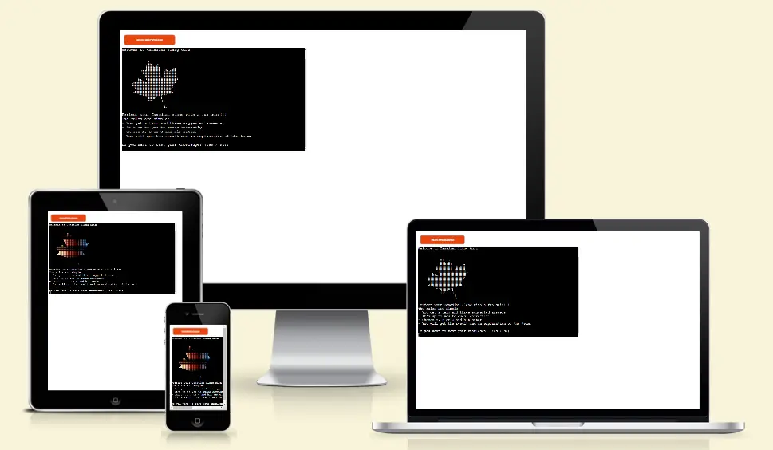
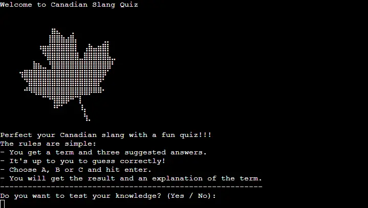

# Canadian Slang Quiz



[Canadian Slang Quiz](https://canadian-slang-quiz.herokuapp.com/) is Python terminal quiz game, which runs in the Code Institute mock terminal on [Heroku](https://heroku.com/).  
Users can test their knowledge of Canadian slang through this quiz. For each term, there are three possible answers from which the user chooses one. For the correct answer, an example of the use of the term is also provided.  
  
[Here you have a live version of the project.](https://canadian-slang-quiz.herokuapp.com/)  

---

## Table of Contents

1. <details>
   <summary><a href="#ux">UX</a></summary>

   - [Visitor Goals](#visitor-goals)
   - [Business Goals](#business-goals)
   - [User Stories](#user-stories)

</details>

2. <a href="#how-to-play">How to Play</a>

</details>

3. <details>
   <summary><a href="#features">Features</a></summary>

   - [Future Features](#future-features)

</details>

4.  <details>
    <summary><a href="#validation-and-testing">Validation and Testing</a></summary>
    <ul>
    <li><a href="#validation">Validation</a></li>
    <li><a href="#testing">Testing</a></li>

    <li>
    <details>
    <summary><a href="#bugs">Bugs</a></summary>

    - [Fixed Bugs](#fixed-bugs)
    </details>
    </li>
    </ul>

</details>
  
5. <details>
    <summary> <a href="#deployment">Deployment</a></summary>

      - [Local Deployment](#local-deployment)
      - [Heroku Deployment](#heroku-deployment)

</details>

6. <a href="#credits">Credits</a>

7. <a href="#tools-and-platforms">Tools and Platforms</a>

8. <a href="#content">Content</a>

9. <a href="#media">Media</a>

---

## UX

### Visitor Goals  
The target audience for [Canadian Slang Quiz](https://canadian-slang-quiz.herokuapp.com/) are:  
- People who are interested in languages (in this case English spoken in Canada).  
- People who already know Canadian slang, but want to confirm their knowledge  
- People who want to learn some Canadian slang.
- People who immigrated to Canada and want to integrate by learning local slang.  
- People who want to have fun and learn something new.  

User goals are:  
- To learn new words through a quiz, and by scoring to motivate to score as many points as possible.  
- To have fun while learning by competing against opponents.  
- To get to know Canada itself through new learned words, for which they will get an explanation.  
- To challenge yourself and question your existing knowledge.  

### Business Goals  
The Business Goals of [Canadian Slang Quiz](https://canadian-slang-quiz.herokuapp.com/) are:  
- To provide a simple educational quiz.  
- Where through the use of the application, users gain knowledge of Canadian slang.  
- By scoring the results, users are encouraged to repeat the quiz in order to be more successful and thus learn faster.  
- Get users interested in Canadian culture.  

### User Stories  
- As a user interested in the quiz, I expect the game instructions to be clear and not complicated.  
- That my score is displayed in the table, and that I can compete with my friends who will get more points.  
- As a user who is interested in language quizzes, I want to get an explanation for the given term (question).  

---

## How to Play  
  
[Canadian Slang Quiz](https://canadian-slang-quiz.herokuapp.com/) is a classic quiz game, with a set question, in this case the question is a language term and three possible answers, one of which is correct.  
Upon launching the application, a welcome message and game rules are displayed.  
For each question there are three offered answers, to which the user answers by entering one of three options: A, B or C.  
The user is given the option to continue with the game and type in name or to quit.  
After ten questions, the user receives as a result the percentage of correctly answered questions entered in the results table.  
The user also receives a congratulatory message and a question whether he wants to repeat the game or to quit.  

---

## Deployment
### Local Deployment
#### Requirements
- An IDE of your choice ([Visual Studio Code](https://code.visualstudio.com/))
- [Git](https://git-scm.com/)
- [Python](https://www.python.org/)

#### How to Clone

1. Go to the repository of [project](https://github.com/radule90/CI_PP_3)
2. Click on the Code button above the list of files
3. Choose one of remote URL: HTTPS, SSH, GitHub CLI and click the copy button or download a copy of the [project repository](https://github.com/radule90/CI_PP_3/archive/refs/heads/main.zip) and extract the zip file to your base folder.
4. In your IDE Terminal change the current working directory to the one where you want the clone
5. Type following code (for example is used GitHub CLI URL) in Git Bash/Terminal of IDE and press Enter:

   ```
   git clone https://github.com/radule90/CI_PP_3.git
   ```

6. You can run the project after you have Python installed, run it on an HTTP server with Python with a command such as:

   ```
   python3 run.py
   ```

#### How to Fork

1. Go to the repository of [project](https://github.com/radule90/CI_PP_3)
2. Bellow navigation bar on the top of the page in right corner you will locate Fork button
3. When clicked, you should have a copy of repository in your GitHub

### Heroku Deployment
- Create a new [Heroku](https://heroku.com/) app, select name and region  
- In Settings, set the buildpacks to Python and NodeJS in that order  
- In Deploy section,  select the Github repository from the menu
- Link the Heroku app to the Github repository  
- Deploy the repository  
- Click the View App button to see live version of the project

---

## Credits

- [Code Institute](https://codeinstitute.net/de/)
- Rory Patrick Sheridan (Mentor) - Great advice and guidance
- [W3Schools](https://www.w3schools.com) - Additional learning resources
- [Bro Code](https://www.youtube.com/watch?v=yriw5Zh406s) - Python quiz game / Used as a reference to build the app  

---

## Tools and Platforms

- [Gitpod](https://gitpod.io/) - IDE for project development
- [Github](https://github.com/) - Storing code remotely
- [Heroku](https://heroku.com/) - Deployment
- [CI Python Linter](https://pep8ci.herokuapp.com/)
- [Python](https://www.python.org/)
- [Am I Responsive](https://ui.dev/amiresponsive) - For device mockup images
- [FireShot: Full Webpage Screenshots + Annotations](https://getfireshot.com/) - Screen Capture
- [cloudconvert](https://cloudconvert.com/png-to-webp) - Online png to webp converter

---

## Content

- The following tutorials and articles helped me arrive at the final code solution
  - [Python quiz game](https://www.youtube.com/watch?v=yriw5Zh406s)  
  - [Build a Quiz Application With Python](https://realpython.com/python-quiz-application/)  
  - [Python for Beginners – Full Course [Programming Tutorial]](https://www.youtube.com/watch?v=eWRfhZUzrAc)  
  - [Python Full Course for free](https://www.youtube.com/watch?v=XKHEtdqhLK8)  

---

## Media

- [Word Power: Test Your Knowledge of These Canadian Slang Terms](https://www.readersdigest.ca/culture/canadian-slang-terms/) - The questions in the quiz are taken from this article  
- [Maple Leaf ASCII Art](https://emojicombos.com/maple-leaf-ascii-art) - The maple leaf used in the quiz was taken from this site  